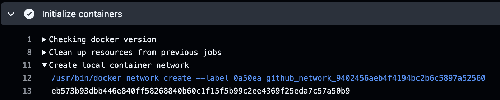

# GCP's default MTU Prevents Network Connections in Docker Containers

By default, GCP sets the [MTU size to 1460][gcp-mtu] bytes. Docker by default sets it to 1500.

The result is any network connections originating from a docker container running on GCP VM fail to reach their destination. The failure mode looks very similar to a blocked firewall. ie, the connection times out after a couple of minutes. 

To fix this you can set docker's MTU config to 1460 - 

```sh
cat <<EOF >/etc/docker/daemon.json
{
  "mtu": 1460
}
```

This only applies to docker's default network though. When running containerized pipelines in github it likes to create a brand new network for each execution. 



[gcp-mtu]: https://docs.cloud.google.com/vpc/docs/mtu

To have the MTU apply to new networks this can be added to the config - 

```sh
cat <<EOF >/etc/docker/daemon.json
{
  "mtu": 1460,
  "default-network-opts": { 
    "bridge": { 
	  "com.docker.network.driver.mtu": "1460" 
    } 
  }
}
EOF
```

This option was added in docker here - 
https://github.com/moby/moby/pull/43197