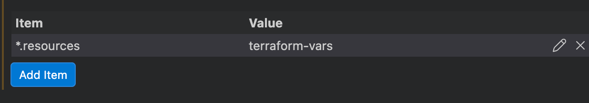

# Custom File Associations in VSCode

You can go to [files.associations](vscode://settings/files.associations) to create a file association for any extension. 

Example - 

If you are in the design stage and want to invent a new file extension for a config, do something like `.resources.tfvars` instead of just `.resources`. So everyone using your project doesn't have to hunt down this option in their code editor.