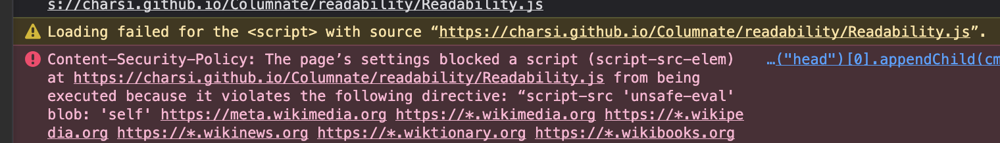
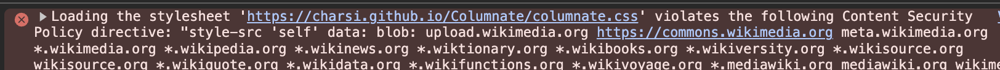

# CSP Breaks Boookmarklets

Wikipedia has enabled CSP rules [script-src][def2] and [style-src][def]. These essentially block loading of resources from outside sources that wikipedia hasn't allowed explicitly.

Thankfully, a few other CDNs are on the list. And the library needed is [available][def4] via jsdelivr. But this won't be a reliable source for every site with CSP rules activated.

Note - Javascript directly embedded in a bookmarklet still works in both, chrome and firefox.

Learned about this while working on a bookmarklet. It is a modified version of [Columnate][def5], based on [Readability.js][def3] by Mozilla.

[def]: https://developer.mozilla.org/en-US/docs/Web/HTTP/Reference/Headers/Content-Security-Policy/style-src

[def2]: https://developer.mozilla.org/en-US/docs/Web/HTTP/Reference/Headers/Content-Security-Policy/script-src
[def3]: https://github.com/mozilla/readability
[def4]: https://www.jsdelivr.com/package/npm/readability-js
[def5]: https://github.com/anoved/Columnate
