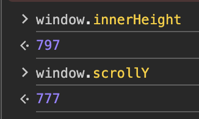
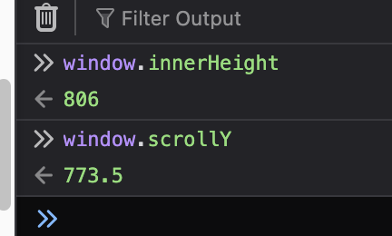

# Spacebar Scrolling does not scroll the full page

All web browsers scroll down a page when you press the spacebar. And scroll up if you press shift + scpace. This is really useful when reading long articles.

But based on some testing I did, in both chrome and firefox the actual scroll distance seems to be a little bit less than the full page height - 

Chrome is short by 20px -  
 

Firefox is short by 32.5 -  

I am guessing this is intentional to help users mantain continuity by showing a little bit of the previous page.