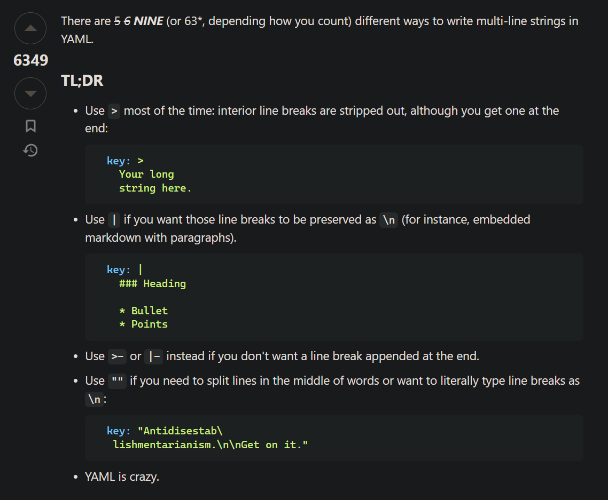

# YAML Strings

Did you know the difference between defining yaml string with `>` vs `|` vs `>-` vs `|-` vs `""` ? 

I was just looking for single vs double quotes in yaml string and stumbled across this. Leaving it here for future reference - 

source: https://stackoverflow.com/a/21699210